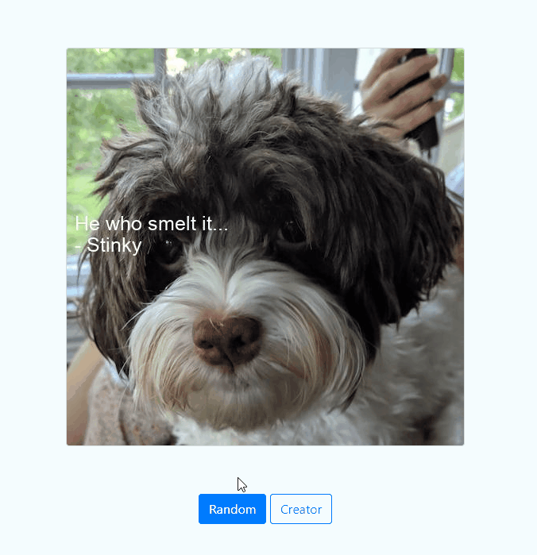

# Meme Generator App
### Udacity Intermediate Python Nanodegree

<span style="color: gray; font-size:1em;">Mateusz Zajac</span>
<br>
<span style="color: gray; font-size:1em;">Oct-2022</span>


## Project Objective
This project was created as part of Intermediate Python Nanaodgree.
It is a simple meme generator written in python which allows to generate your own motivational memes. In case you lack ideas, there is a sample of quotes and pictures of cute dogs. The project includes both a Flask web app and a CLI interface.


## Project Setup
1. Clone the repository
2. Setup and activate the virtual environment
```
cd ./ *your folder*
python3 -m venv .venv
source .venv/bin/activate
```
3. Install python dependencies
```
pip install -r requirements.txt
```


## Usage 
The implementation of this project has been split into two parts.

**Using CLI**
```
python meme.py
usage: meme.py [-h] [-p path] [-b body] [-a author]

optional arguments:
    -h, --help		help message
    -p, --path  		path to the image
    -b, --body  		motivational quote written to image
    -a , --author		author of a quote written to image
```
When no arguments are provided, the app generates a random meme using the sample of quotes and pictures of dogs.

**Using Flask**
```
export FLASK_APP=app
flask run
```
Now head over to  [http://127.0.0.1:5000/](http://127.0.0.1:5000/) and you should see the meme web app.
Check the following for more details:  [Flasks Documentation](https://flask.palletsprojects.com/en/2.2.x/quickstart/)


## Results
